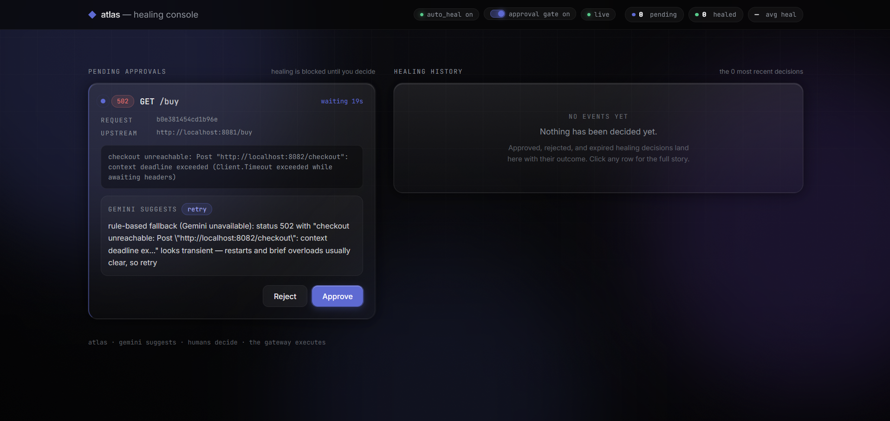
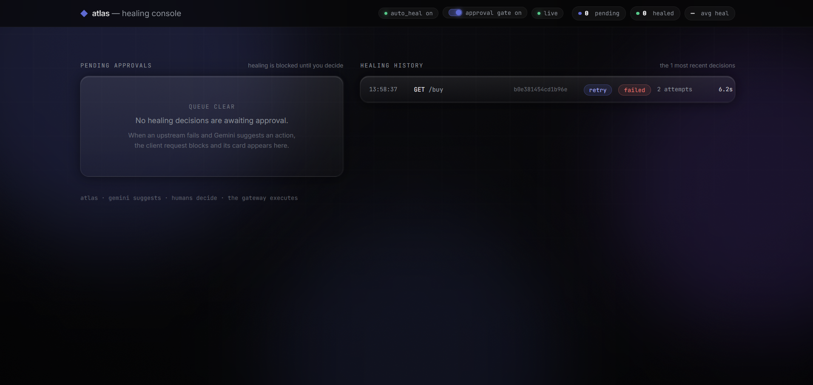
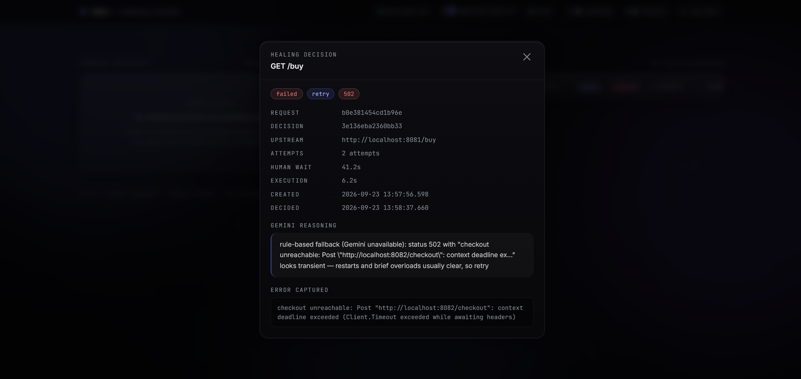

<p align="center">
  <svg width="40" height="40" viewBox="0 0 14 14"><path d="M7 0 L14 7 L7 14 L0 7 Z" fill="#5E6AD2"/></svg>
</p>

<h1 align="center">atlas</h1>

<p align="center">
  <b>The self-healing API gateway — AI triage, human approval, automatic recovery.</b><br>
  <sub>When a request fails, atlas asks Google Gemini what to do, shows the plan to a human on a live console, and executes the approved fix: retry with backoff, reroute to a fallback, or give up gracefully. Every decision audited.</sub>
</p>

<p align="center">
  <a href="https://github.com/RajNair06/atlas/actions/workflows/ci.yml"></a>
  
  
  
</p>

<p align="center">
  <a href="https://rajnair06.github.io/atlas/"><b>Documentation site</b></a> ·
  <a href="https://github.com/RajNair06/atlas/blob/main/docs/assets/nav.mp4"><b>Watch the 30-second demo</b></a> ·
  <a href="https://rajnair06.github.io/atlas/quickstart.html"><b>Quickstart</b></a>
</p>

---

## The 30-second story

A payment service dies mid-traffic:

1. **Capture** — the gateway freezes the failed request's full context (headers, body, error, timing) under a correlation ID
2. **Analyze** — Gemini reads it and returns a structured verdict: `retry`, `fallback`, or `give_up`, with written reasoning
3. **Approve** — a card lands on the live console (SSE, no refresh); the client's request waits for a human click
4. **Heal** — approved → the request is replayed with exponential backoff → the waiting client gets a normal `200`, with `X-Healed: true`

<p align="center">
  <a href="https://github.com/RajNair06/atlas/blob/main/docs/assets/nav.mp4">
    
  </a>
  <sub>↑ the approval moment — click for the full video</sub>
</p>

<p align="center">
  
  
</p>

## Why it's interesting

| | |
|---|---|
| **LLM with guardrails** | Gemini chooses from a closed menu of actions; responses are schema-validated; hallucinated actions are rejected at the door |
| **Rule-based fallback brain** | LLM down or overloaded? A deterministic rule engine keeps healing alive — and every suggestion discloses which brain produced it |
| **Human-in-the-loop** | Approval gate blocks the request until a verdict arrives; toggle it live from the console, no restart |
| **Production patterns** | Per-upstream circuit breakers (~2ms fast-fail), exponential backoff, latency budgets, correlation IDs, graceful shutdown |
| **Real-time console** | SSE + htmx + Go templates — zero npm dependencies, no build step, embedded in the binary |
| **Proven** | 114+ tests incl. full-stack E2E through the real proxy with fake LLMs; `-race` clean; ~92% proxy coverage |

## Quickstart

```bash
git clone https://github.com/RajNair06/atlas.git
cd atlas
echo "GEMINI_API_KEY=your_key" > .env     # free key: aistudio.google.com/app/apikey
cp gateway.yaml.example gateway.yaml
make gateway                              # builds + starts gateway (:8080) and the demo shop
```

Open the console: **http://localhost:8080/ui** — then break something on purpose:

```bash
pkill -x payment                          # kill a backend service
curl -v http://localhost:8080/buy         # hangs — waiting for YOUR approval
```

Watch the approval card appear live on the console. Approve it (after restarting payment) and the hanging curl completes healed. Full walkthrough: **[quickstart →](https://rajnair06.github.io/atlas/quickstart.html)**

> No API key? Everything still works — the rule engine takes over and says so in its reasoning.

## Configuration

One YAML file. Routes, timeouts, retries, fallbacks, breaker settings, approval behavior:

```yaml
server:
  port: 8080
  auto_heal: true          # master switch
  require_approval: true   # initial state — toggle live from the console
  approval_timeout: 120s
  healing_budget: 5s       # machine-time cap per healing run
  breaker_threshold: 10    # consecutive failures → circuit opens

routes:
  - path: /buy
    upstream: http://localhost:8081
    fallback: http://localhost:8084   # used by the fallback action + last resort
    timeout: 10s
    retries: 3
```

Full reference: **[architecture →](https://rajnair06.github.io/atlas/architecture.html)**

## Repository layout

```
gateway/            the product — one Go binary
├── proxy/          reverse proxy · error capture · request replay
├── healing/        decision engine · executor · circuit breakers · gate
├── llm/            Gemini client (injectable base URL for tests)
├── approval/       pending decisions · history · SSE hub · runtime toggle
├── webui/          the console (embedded templates, no build step)
└── config/         YAML + ${ENV} substitution + fail-fast validation
examples/demo-shop/ storefront → checkout → payment (breakable fixtures)
scripts/            start/stop/demo/test helpers
docs/               the documentation site (GitHub Pages)
```

## Development

```bash
make test               # full suite
./scripts/test-all.sh   # build + vet + race tests + coverage
make gateway            # run everything locally
./scripts/demo-approval.sh   # automated end-to-end approval demo
```

CI runs `go vet` + `go test -race` on every push; the docs site deploys automatically via GitHub Pages.

---

<p align="center"><sub>atlas · gemini suggests · humans decide · the gateway executes</sub></p>
